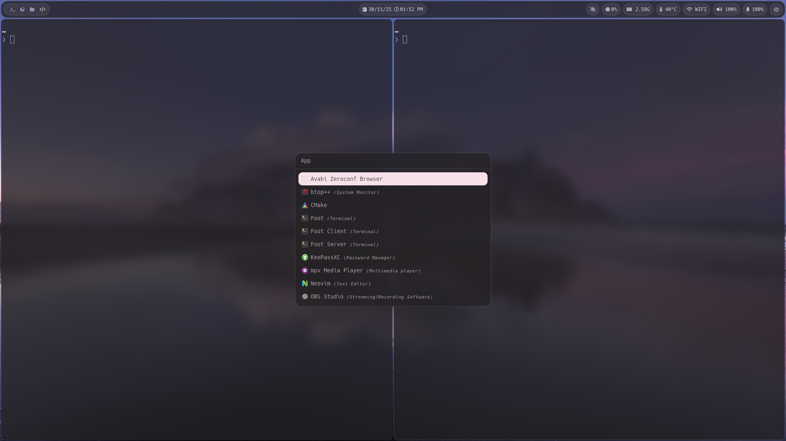

# Arch Linux Dotfiles

My personal dotfiles for Arch Linux

> NOTE: These dotfiles are tailored for my specific workflow.\
Please review before applying it to your system.

## Screenshot

## Programs

- Window manager: [Hyprland](https://github.com/hyprwm/Hyprland)
- Bar: [Waybar](https://github.com/Alexays/Waybar)
- Terminal: [Foot](https://codeberg.org/dnkl/foot)
- Shell: [Zsh](https://www.zsh.org/)
- Menu: [Rofi](https://github.com/davatorium/rofi)
- Notification: [Dust](https://github.com/dunst-project/dunst)
- File Manager: [Yazi](https://github.com/sxyazi/yazi)
- Text Editor: [Neovim](https://github.com/neovim/neovim)
- Lockscreen: [Hyprlock](https://github.com/hyprwm/hyprlock)
- Media Player: [Mpv](https://github.com/mpv-player/mpv)
- Document Viewer: [Zathura](https://github.com/pwmt/zathura)
